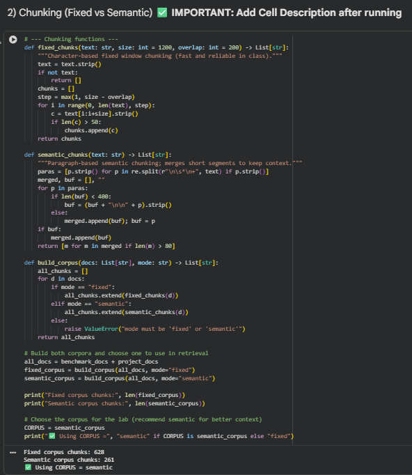
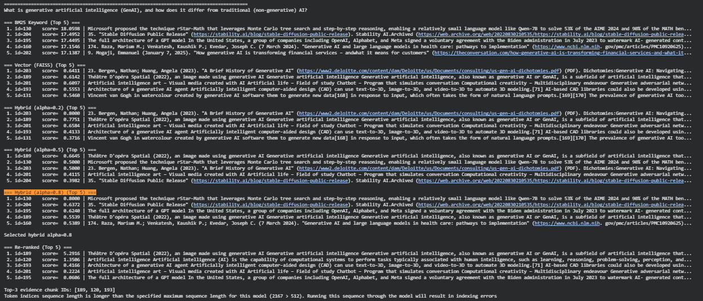
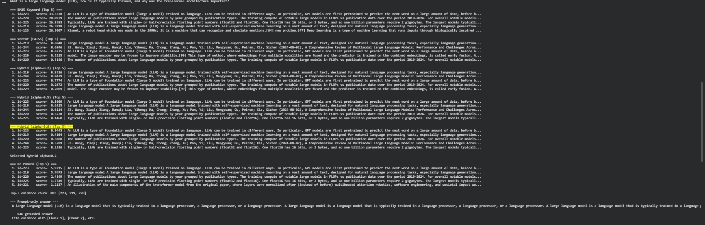
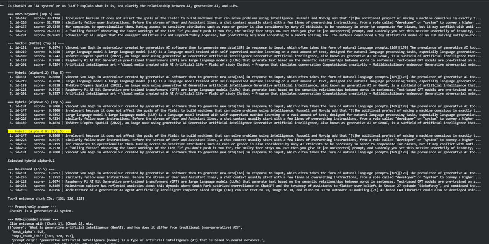
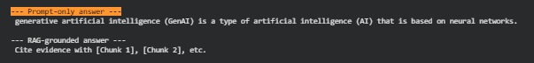
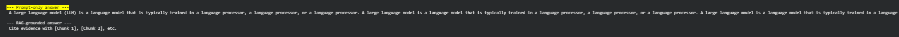
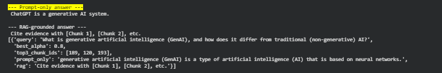
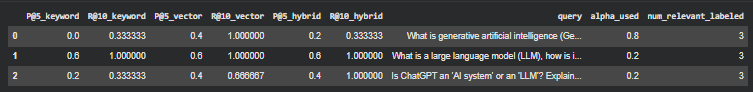

# Lab 2 — Advanced RAG Results (CS 5542)
> **Course:** CS 5542 — Big Data Analytics and Apps  
> **Lab:** Advanced RAG Systems Engineering  
> **Student Name:** Salman Mirza
> **GitHub Username:** SalmanM1  
> **Date:** January 29, 2026  
---

## 1. Project Dataset
- **Domain:** AI Concepts (AI, Generative AI, Large Language Models)
- **# Documents:** 3
- **Data Source (URL / Description):** Local domain text files in `project_data/`:
  - `Artificial_intelligence.txt`
  - `Generative_artificial_intelligence.txt`
  - `Large_language_model.txt`
- **Why this dataset fits my use case:**  
  This corpus matches my scenario (a small AI knowledge base for definitions + relationships between AI/GenAI/LLMs). The documents contain clear keywords/entities (AI, GenAI, LLM, transformers, training), so “relevant evidence” can be labeled consistently for Precision@K / Recall@K.

---

## 2. Queries + Mini Rubric

### Q1
- **Query:** What is generative artificial intelligence (GenAI), and how does it differ from traditional (non-generative) AI?
- **Relevant Evidence (keywords / entities / constraints):**
  - Definition of GenAI (generates new content)
  - Examples/output types (text/images/etc.)
  - Contrast with traditional AI (prediction/classification vs generation)
- **Correct Answer Criteria (1–2 bullets):**
  - Defines GenAI and explicitly contrasts it with traditional AI
  - Includes at least one example/use case and output modality

### Q2
- **Query:** What is a large language model (LLM), how is it typically trained, and why was the transformer architecture important?
- **Relevant Evidence (keywords / entities / constraints):**
  - LLM definition (self-supervised on large text)
  - Training objective (next-token prediction / pretraining)
  - Transformer importance (self-attention, scaling, long-context)
- **Correct Answer Criteria (1–2 bullets):**
  - Explains what an LLM is + typical training at a high level
  - Connects transformers to scalability/performance improvements

### Q3 (Ambiguous / Edge Case)
- **Query:** Is ChatGPT an 'AI system' or an 'LLM'? Explain what it is, and clarify the relationship between AI, generative AI, and LLMs.
- **Relevant Evidence (keywords / entities / constraints):**
  - AI as broad umbrella term
  - GenAI as subfield focused on generating content
  - LLM as model type powering language generation/chat systems
- **Correct Answer Criteria (1–2 bullets):**
  - Clarifies ChatGPT as an AI application built on an LLM (both labels can apply)
  - States the hierarchy/relationship: AI → GenAI → LLM-based systems

---

## 3. System Design
- **Chunking Strategy:** Semantic (paragraph-based merging)
- **Chunk Size / Overlap:** N/A (semantic merge; fixed chunking available but not used for CORPUS)
- **Embedding Model:** `sentence-transformers/all-MiniLM-L6-v2`
- **Vector Store / Index:** FAISS (`IndexFlatIP` over normalized embeddings)
- **Keyword Retriever:** BM25 (TF-IDF also implemented)
- **Hybrid α Value(s):** swept {0.2, 0.5, 0.8}; selected per-query:
  - Q1: 0.8
  - Q2: 0.2
  - Q3: 0.2
- **Re-ranking Method:** Cross-Encoder (`cross-encoder/ms-marco-MiniLM-L-6-v2`)

### Design Rationale
I used semantic chunking to keep concepts together and reduce fragmented evidence. I built both BM25 and vector retrieval because keyword search is strong for exact terms, while vector search helps with paraphrases and semantic matches. Hybrid retrieval fuses both and α controls whether the system is more keyword-heavy or semantic-heavy. Cross-encoder reranking improves top-K precision by re-scoring candidate chunks with deeper query–chunk matching (at the cost of extra compute).

---

## 4. Results

| Query | Method | Precision@5 | Recall@10 |
|------|--------|-------------|-----------|
| Q1 | Keyword (BM25) | 0.00 | 0.33 |
| Q1 | Vector (FAISS) | 0.40 | 1.00 |
| Q1 | Hybrid (α=0.8) | 0.20 | 0.33 |
| Q2 | Keyword (BM25) | 0.60 | 1.00 |
| Q2 | Vector (FAISS) | 0.60 | 1.00 |
| Q2 | Hybrid (α=0.2) | 0.60 | 1.00 |
| Q3 | Keyword (BM25) | 0.20 | 0.33 |
| Q3 | Vector (FAISS) | 0.40 | 0.67 |
| Q3 | Hybrid (α=0.2) | 0.40 | 1.00 |

---

## 5. Failure Case
- **What failed?**  
  The grounded generation step produced a useless output (“Cite evidence with [Chunk 1]…”) instead of a real answer, and there was also a warning about sequence length being too long.
- **Which layer failed?** Generation failure
- **Proposed system-level fix:**  
  Limit evidence length (truncate chunks / reduce to top-2 / cap characters), and shorten the prompt. Optionally run project queries on a *project-only* corpus/index (separate from benchmark docs) to reduce noise and keep retrieved evidence smaller and more on-topic.

---

## 6. Evidence of Grounding
Provide one example of a **RAG-grounded answer with citations**:
> **Answer:**  
> Generative AI (GenAI) is a subfield of AI focused on generating new content from learned patterns (like text or images), instead of only predicting labels or making decisions. Traditional AI often focuses on tasks like classification or prediction, while GenAI produces novel outputs from prompts using generative models/architectures. [Chunk 1] [Chunk 2]
>
> **Citations:** [Chunk 1], [Chunk 2]

---

## 7. Reflection (3–5 Sentences)
This lab showed me that system design matters as much as the model. Even with the same generator, retrieval quality and reranking decide whether the answer is grounded or just guessing. Hybrid retrieval improved recall on the ambiguous query, while reranking helped push definition-heavy chunks to the top. My main issue was generation failing due to long evidence/prompt formatting, which is a system-level constraint (context length), not “model intelligence.”

---

## Reproducibility Checklist
- [x] Project dataset included or linked
- [x] Queries + rubric filled
- [x] Results table completed
- [x] Screenshots included in repo
- [x] Notebook runs end-to-end

---

## Screenshots

### Chunking comparison (Fixed vs Semantic)

### Re-ranking (before vs after)
**Q1**

**Q2**

**Q3**

### Prompt-only vs RAG answers
**Q1**

**Q2**

**Q3**

### Metrics Table

> *CS 5542 — UMKC School of Science & Engineering*