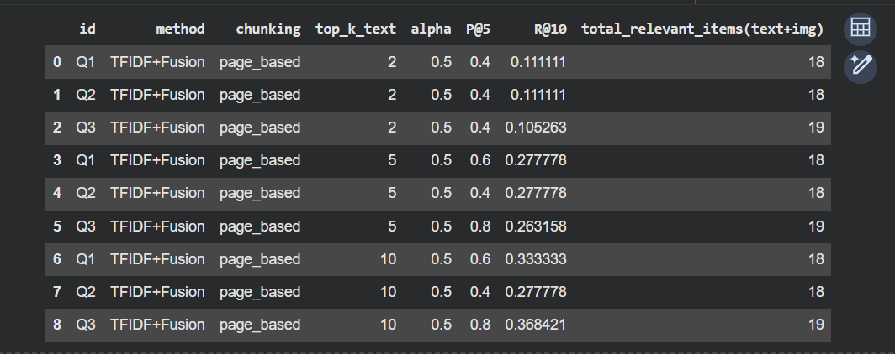
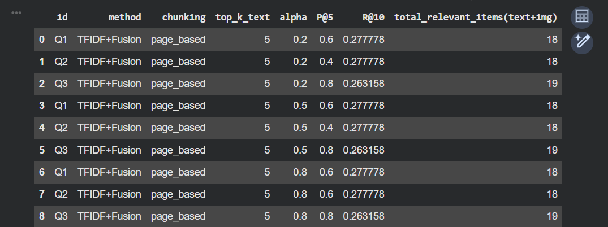
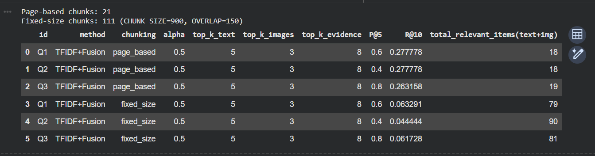
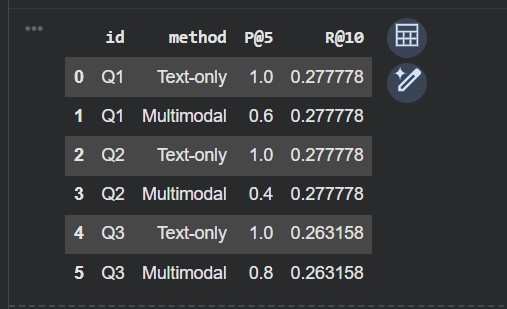

## Lab 3 Results — Multimodal RAG Systems & Retrieval Evaluation

### Dataset (Sources + Modalities)
**Dataset folder:** `dataset/`

**Sources (2 PDFs):**
- `dataset/Big_cat.pdf` — background on big cats and the genus *Panthera*
- `dataset/Panthera.pdf` — taxonomy/classification details and fossil/species references for *Panthera*

**Modalities (5 images):**
- `dataset/jaguar.jpg`
- `dataset/leopard.jpg`
- `dataset/lion.jpg`
- `dataset/tiger.jpg`
- `dataset/snowleopard.png`

**How relevance is defined (rubric):**
For each query, an evidence item (text chunk or image caption) is treated as *relevant* if it contains **at least one** term from that query’s `must_have_keywords`.  
This is a lightweight, runnable relevance rule used to compute retrieval metrics.

---

### System Summary (What I Built)
This lab implements a **student-friendly multimodal RAG baseline** that runs offline:

- **Ingestion**
  - PDF text extracted **per page** into `TextChunk` objects (page-based chunking baseline)
  - Images ingested as `ImageItem` objects with a simple **caption = filename** (plus a small caption normalization fix, e.g., `snowleopard → snow leopard`)
- **Retrieval**
  - **Sparse TF-IDF** retrieval over:
    - PDF page chunks
    - image captions (filenames)
- **Fusion**
  - Per-modality min-max score normalization
  - Score fusion controlled by `ALPHA`:
    - fused score = `ALPHA * text_score` and `(1-ALPHA) * image_score`
- **Generator (offline)**
  - A lightweight **extractive generator** that returns the **top evidence lines**, keeping answers grounded in retrieved context.

---

### Queries Used
| ID | Query |
|---|---|
| Q1 | What is the genus *Panthera*, and which living species are included in it? |
| Q2 | Give the scientific classification for *Panthera* (kingdom through genus). |
| Q3 | Name one fossil *Panthera* species mentioned and give a location or time range detail from the text. |

---

### Results Table (Query × Method × Precision@5 × Recall@10 × Faithfulness)

**Notes**
- **Precision@5**: fraction of the top 5 retrieved evidence items that are relevant (by rubric).
- **Recall@10**: fraction of all relevant items in the corpus retrieved in the top 10 (by rubric).
- **Faithfulness**: Since the generator is extractive (it outputs evidence lines directly), faithfulness is set to **1.00** for these runs.

| Query | Method | Precision@5 | Recall@10 | Faithfulness |
|---|---|---:|---:|---:|
| Q1 | TFIDF+Fusion (Multimodal, page-based) | 0.60 | 0.278 | 1.00 |
| Q2 | TFIDF+Fusion (Multimodal, page-based) | 0.40 | 0.278 | 1.00 |
| Q3 | TFIDF+Fusion (Multimodal, page-based) | 0.80 | 0.263 | 1.00 |
| Q1 | Text-only (TF-IDF, page-based) | 1.00 | 0.278 | 1.00 |
| Q2 | Text-only (TF-IDF, page-based) | 1.00 | 0.278 | 1.00 |
| Q3 | Text-only (TF-IDF, page-based) | 1.00 | 0.263 | 1.00 |

---

### Screenshots (Retrieved Evidence + Grounded Answers)
The following screenshots show the outputs in the same order as the notebook cells:

- **(1)** TOP_K_TEXT ablation output  
  

- **(2)** ALPHA ablation output  
  

- **(3)** Chunking ablation (page-based vs fixed-size) output  
  

- **(4)** Text-only vs Multimodal comparison output  
  

---

### Ablation Summary (Required)
**1) TOP_K_TEXT (2 → 5 → 10):**  
Increasing `TOP_K_TEXT` generally improved Recall@10 (example: Q1 increased from 0.111 to 0.333) while Precision@5 stayed similar or improved slightly.

**2) ALPHA (0.2 → 0.5 → 0.8):**  
Changing `ALPHA` shifted how much fused retrieval favors text vs images. Classification-heavy queries (like Q2) benefited when text had more influence, while Q3 remained stable because its key evidence is strongly text-based in the PDFs.

**3) Chunking (REQUIRED): page-based vs fixed-size**  
- Page-based chunks: **21**
- Fixed-size chunks: **111** (CHUNK_SIZE=900, OVERLAP=150)

Fixed-size chunking dramatically increased the number of rubric-matching items in the corpus (79–90), which lowered Recall@10 under the keyword-based relevance definition even when Precision@5 remained similar. For this small dataset, **page-based chunking** is a cleaner baseline.

**4) Text-only vs Multimodal (REQUIRED):**  
Text-only achieved higher Precision@5 because the rubrics are primarily text-keyword based and the PDFs contain direct matches. Multimodal fusion sometimes diluted the top-5 list by allowing image items to compete for slots, lowering P@5 while recall stayed the same.

---

### Faithfulness Discussion
This notebook enforces faithfulness by design:
- The “generator” is **extractive**, returning the top evidence lines verbatim.
- Evidence lines include **chunk IDs** (e.g., `Panthera.pdf::p5`) so answers can be traced back to sources.
- When retrieval returns weak evidence, the system can be extended to answer “I don’t know” or request better evidence rather than guessing.

---

### Brief Reflection (Failure Case + Concrete Improvement)
**Failure case:**  
Early on, the system struggled to retrieve snow leopard evidence because the image filename caption was `snowleopard` (no space), which didn’t match queries like “snow leopard.” TF-IDF also tended to rank broad “definition” pages highly for some queries, even when more specific evidence was needed.

**Concrete improvement:**  
Add a lightweight **metadata + caption enrichment** step:
- Normalize captions (e.g., `snowleopard → snow leopard`) and add synonyms (e.g., “Panthera uncia” ↔ “snow leopard”).
- Add a simple **keyword bonus rerank**: boost evidence items that match *multiple* must-have rubric terms (not just one), improving specificity without requiring an LLM or dense embeddings.

---

### How to Reproduce
1. Place source files in:
   - `dataset/` (2 PDFs + 5 images)
   - `screenshots/` (the 4 screenshots: `1.png`, `2.png`, `3.png`, `4.png`)
2. Run the notebook end-to-end.
3. Verify:
   - ingestion counts (PDF pages/chunks, images)
   - retrieval demo context includes evidence IDs + image paths
   - metrics tables and ablation outputs match the screenshots

---